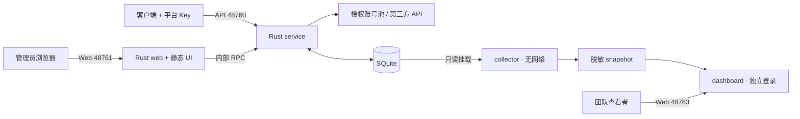

# 架构

Team AI Gateway 将管理后台、模型请求代理和只读团队看板分成不同边界。The Linux deployment consists of one gateway container and two optional dashboard components.

图中端口默认仅绑定宿主 `127.0.0.1`。HTTPS 代理或 Tunnel 由部署者单独管理，不属于默认 Compose 服务。

## 源码与职责

| 路径 | 职责 |
| --- | --- |
| `apps/src` | Next.js/React 管理界面、API transport、模型与 Key 配置；静态导出 |
| `apps/src-tauri` | 保留的上游桌面壳和兼容实现，不属于本次 Linux/Web 发布流程 |
| `crates/core` | 数据模型、SQLite 存储和迁移 |
| `crates/rusqlite` | 本地 SQLx/SQLite 兼容层，其他 crate 的实际构建依赖 |
| `crates/service` | HTTP/RPC、鉴权、账号和 Key、路由、协议转换、上游连接及统计 |
| `crates/web` | 嵌入静态 UI、后台登录、Web runtime 与 RPC 代理 |
| `crates/start` | 管理 service 与 web 子进程生命周期 |
| `services/dashboard` | Python collector、FastAPI 看板、静态展示和测试 |
| `deploy` / `scripts` | 镜像、Compose、启动校验、私有目录初始化、备份和发布检查 |

前端先生成 `apps/out`，随后 Rust Web 构建将其嵌入二进制。容器中的 `codexmanager-start` 同时启动 service 与 web。保留 `codexmanager-*` 二进制名和 `CODEXMANAGER_*` 配置名用于兼容现有数据与调用链。

## 请求与状态

平台 Key 在服务入口鉴权，Key 的模型、账号分组、路由和额度限制决定它能使用的上游。正常请求仍按既有调度与会话绑定选择账号；新增动态路径只处理特定可安全重放的容量失败，见 [调度说明](docs/SCHEDULING.md)。

持久化账号、Key、使用记录和会话绑定存于 SQLite。账号在途计数、容量熔断和重试预算属于服务进程内存；多个实例不会自动共享它们。默认架构面向单个写入主服务，不把多个独立数据库副本当成可互换的副本服务。

Web 后台账号、客户端平台 Key 和看板登录是三套独立的访问凭据。客户端不应使用后台域名作为 API endpoint；看板没有管理 RPC，也不持有平台 Key。

## 只读看板

collector 使用数据库只读连接和字段白名单，仅导出需要展示的统计和脱敏标识。它没有网络，源数据库挂载只读；输出 snapshot 由 dashboard 只读挂载。dashboard 无法访问源数据库，使用独立共享查看账号及进程内会话，因此重启会清除会话，默认保持单 worker。

“今日”和“近 7 天”按看板采集器当前的 UTC+8 统计日界线计算。分组按 Key 当前的账号分组筛选归属，修改分组会使该 Key 的历史量重新归入新组。它不等价于各上游账号实际承载的用量。模型展示动态读取数据库中 `visibility=list` 且名称通过校验的目录；禁用状态保留，隐藏模型不导出，缺失价格保持未知。

## 可选宿主维护任务

`scripts/model-sync/` 通过管理员 RPC 添加已验证的最新 Codex 模型；它读取私有数据库校验探测 Key，使用真实平台 Key 验证流式请求，并独立原子发布客户端目录快照。它与无网络的只读 collector 是独立进程；默认 Compose 不安装或启用每日 timer。

`scripts/proxy/` 维护既有 Mihomo 实例，通过私有美国节点认证清单构建 `url-test` 自动组，检测、备份、应用配置并在失败时回滚。每日模型目录与代理节点选择属于运行数据，不要求每日提交 Git 或重建镜像。

备份边界与恢复方法见 [备份与升级](docs/BACKUP_AND_UPGRADE.md)，鉴权及公网入口边界见 [安全说明](SECURITY.md)。
